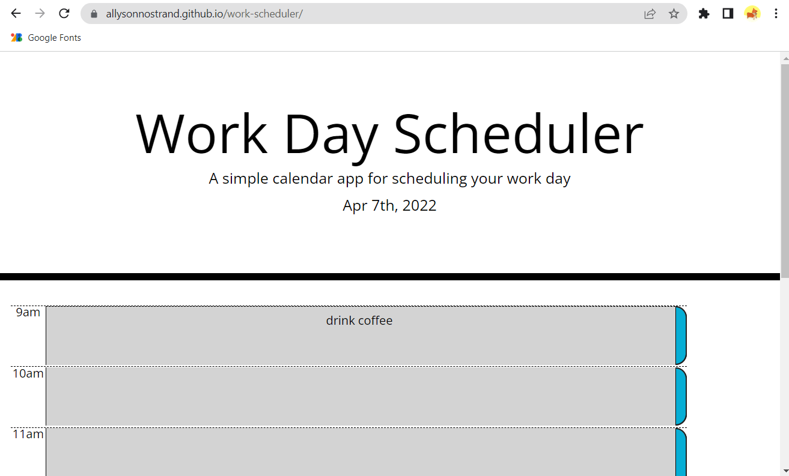

# work-scheduler

## Link 
Work Scheduler https://allysonnostrand.github.io/work-scheduler/

## Description

The goal for this assignment was to create a daily planner so that the user can manage their time effectively. This assignment provided some starter code that mostly consisted of css. 

I essentially worked backwards to put together my html. I carefully examined the css style page to look at what elements were provided for the given classes and distributed those classes to tags I created. It took a bit of time and I referenced bootstrap formats to help piece everything together. 

The finished product displays the current date in the top jumbotron, using moment js. For each hour row, the user is able to type in their activities for the hour and it will be saved to local storage upon hitting the save button at the end of the row--- along with the corresponding hour- and it will stay on the page even when its refreshed. 

Each row also changes color to reflect whether the time it corresponds with is the current hour(red), an hour that already passed(gray), or an hour that has yet to come(green). This makes it so the user can easily look at their planner and combat their tasks that are highlighted in red. 

# Screenshots 

Here is what the site looks like.

Here is how the user input looks upon refreshing the page. 

